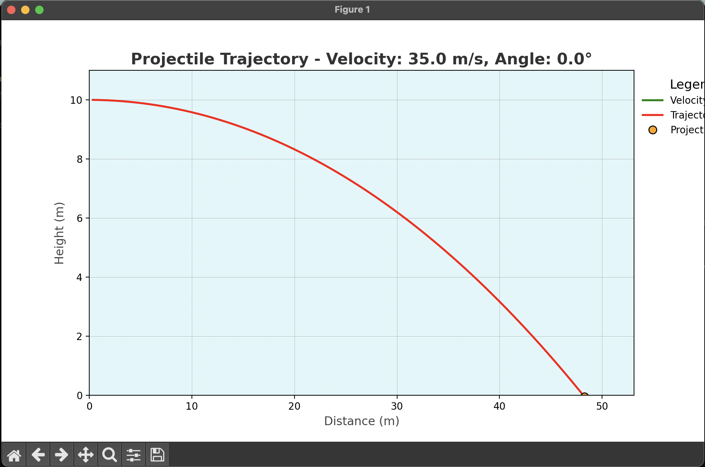

# 🎯 Ballistic Trajectory

A visually interactive simulation of ballistic trajectories, showcasing the effect of various parameters like velocity, angle, and height on the projectile's motion. 🚀

---

## 📜 Table of Contents
- [Introduction](#introduction-)
- [Features](#features-)
- [Images](#images-)
- [How to Use](#how-to-use-)
- [Technical Details](#technical-details-)
- [Contributing](#contributing-)


---

## 🔍 Introduction
This project simulates the motion of a projectile using real-world physics. By adjusting parameters such as the launch angle, velocity, and height, users can visualize the resulting trajectory.

---

## ✨ Features
- 📈 Simulates projectile motion with precision.
- 🎨 Graphical visualization of trajectories.
- 🧮 Parameter-based customization:
  - **Initial velocity**: Adjust the speed of the projectile.
  - **Launch angle**: Change the angle of projection.
  - **Height**: Modify the initial height of launch.

---

## 🖼️ Images
Below are sample visuals of the simulation:

### 1. Regular Trajectory


---

### 2. Heighted Launch


---

### 3. Inclined Plane


---

## 🚀 How to Use
1. Clone this repository:
   ```bash
   git clone https://github.com/yourusername/Ballistic-Trajectory.git
   cd Ballistic-Trajectory
   
2. Ensure you have Python installed.

3. Install the required dependencies:
    ```bash
    pip install -r requirements.txt
    
4. Run the simulation:
    ```bash
    python main.py
    
---

## 🛠️ Technical Aspects
**Language**: Python 🐍

**Graphics Library**: Matplotlib

---

## 🤝 Contributing
Contributions are welcome! Feel free to open issues or submit pull requests. 💡

1. Fork the repository.


2. Create your branch:
    ```bash
    git checkout -b feature-name

3. Make your changes and test them.
4. Submit a pull request with detailed information.


# 😊
    
    
    
